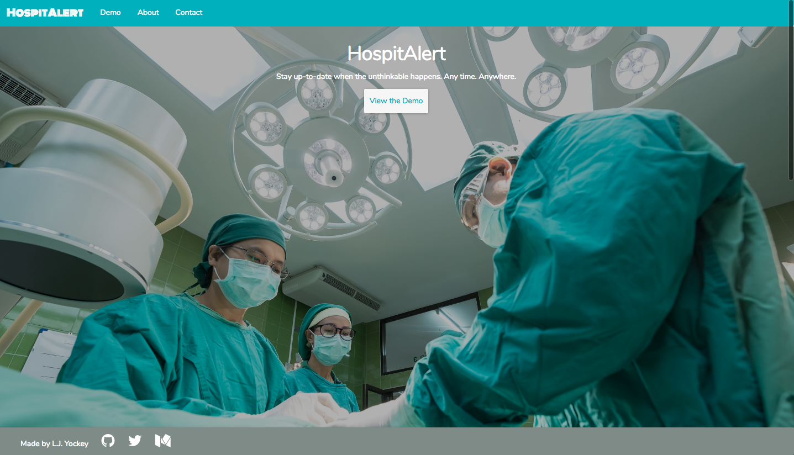

<h1>HospitAlert</h1>
<p><a href="https://hospitalert.herokuapp.com">HospitAlert</a> is a responsive full-stack app that allows users to keep their family up-to-date when a loved one is hospitalized.</p>
<br>

## Getting started
### Installing
```
>   git clone https://github.com/Ljyockey/hospitalert.git
>   cd hospitalert
>   npm install
```
### Launching
```
>   npm start
```
Then open [`localhost:8080`](http://localhost:8080) in a browser.
### Testing
```
>   npm test
```

<h2>Introduction</h2>
<p>The main focus of HospitAlert is to keep family up-to-date when a loved one is hospitalized if they are unable to make it to the hospital themselves.</p>

<h2>How it Works</h2>
<h3>Add an event (hospitalization)</h3>

<p>Add an event when a loved one is hospitalized. Basic information can be added like the patient's name, their condition (reason for being in the hospital), whether or not they're conscious, and the latest update from the doctor.</p>
<h3>Answer questions</h3>
<p>People who are able to view the hospitalizations you've posted can ask questions that they may have for the doctor. When you have an answer, you can post it so that everyone is on the same page.</p>

<h2>Technology</h2>
<h3>Front End</h3>
<ul>
  <li>HTML5</li>
  <li>CSS3</li>
  <li>JavaScript</li>
  <li>jQuery</li>
</ul>
<h3>Back End</h3>
<ul>
  <li>Node.js + Express.js (web server)</li>
  <li>MongoDB (database)</li>
  <li><a href="https://mochajs.org/">Mocha</a> + <a href="http://chaijs.com/">Chai</a> (testing)</li>
  <li>Continuous integration and deployment with <a href="https://travis-ci.org/">Travis CI</a></li>
</ul>
<h3>Code Attributions</h3>
<ul>
	<li><a href="https://getmdl.io/index.html">Material Design</a></li>
	<li><a href="http://getbootstrap.com/getting-started/">Bootstrap</a></li>
	<li><a href="http://fontawesome.io/">Font Awesome</a></li>
</ul>
<h3>Responsive</h3>
<ul>
  <li>The app is fully responsive and quickly adapts to all mobile, tablet, and desktop viewports.</li>
</ul>

<h2>This is V1</h2>
<p>V1 is a demo. V2 is coming soon and will introduce:</p>
<ul>
	<li>User accounts</li>
	<li>The ability to login through Facebook</li>
	<li>SQL instead of MongoDB</li>
	<li>React</li>
</ul>

